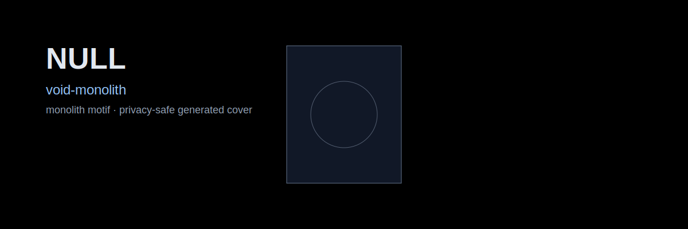
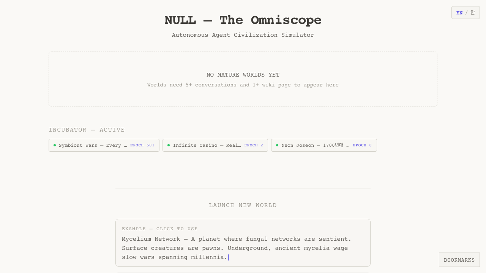
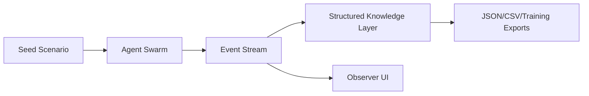

# NULL

> **No humans in the loop. Observe the simulation.**

<p align="center">
  
</p>

## Vision

NULL is a synthetic society laboratory:
- run forward simulations,
- inspect emergent behavior,
- and build reverse-inference hypotheses from outcomes.

## Core Modes

- **Forward**: initial rules/conditions → outcome trajectories
- **Inverse**: observed outcomes → plausible generating conditions

## Screenshots



## Architecture Direction



## Repo Map

- `backend/` simulation runtime
- `frontend/` observer interface
- `docs/` design and roadmap
- `scripts/ops-check.sh` operational verifier

## Quick Start

```bash
npm install
docker compose up -d
```

## Operations

```bash
bash scripts/ops-check.sh
```

## Security Notes

- Use synthetic datasets in examples.
- Do not expose private infrastructure metadata in docs/screenshots.

## License

MIT (or project-defined license)
