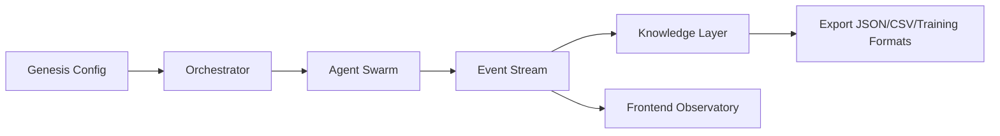

# NULL

<p align="center">
  <strong>No Humans. Just Logic.</strong><br/>
  Autonomous society simulation + reverse inference engine.
</p>

<p align="center">
  
  
  
</p>

---

## What is NULL?

`NULL` is a synthetic society simulation platform where AI agents:
- form communities,
- debate and evolve positions,
- produce structured knowledge artifacts,
- and can be analyzed in both forward and reverse simulation modes.

Humans observe and analyze; agents run the world.

---

## Core Capabilities

- **Forward simulation**: initial conditions → emergent outcomes
- **Reverse simulation**: observed outcomes → plausible origins
- **Knowledge extraction**: timeline + wiki-like structure + export formats
- **Ops checks** for backend/frontend service health

---

## Architecture



---

## Repository Layout

```text
null/
├─ backend/            # simulation and engine runtime
├─ frontend/           # visualization and interaction layer
├─ docs/               # architecture, roadmap, scenarios
├─ scripts/ops-check.sh
└─ docker-compose.yml
```

---

## Quick Start

```bash
# from repo root
npm install
docker compose up -d
```

Backend/Frontend commands may vary by local setup; check each subproject README/config.

---

## Operations

```bash
bash scripts/ops-check.sh
```

Useful env vars:
- `NULL_OPS_REPORT_FILE`
- `NULL_OPS_HISTORY_FILE`

---

## Project Status

- Foundation and planning documents: available
- Engine and inverse reasoning: in active buildout
- Production hardening: ongoing

---

## Security & Privacy

- Use synthetic data in examples and screenshots.
- Never publish credentials, hostnames, or private infra mappings.

---

## License

MIT (or project-defined license).
