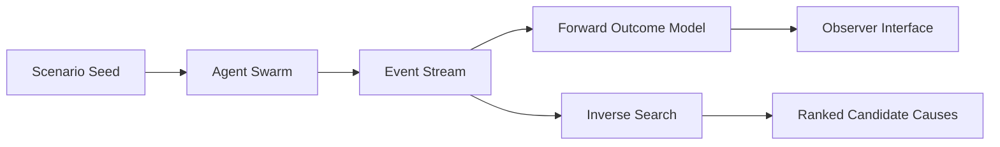

# NULL

<p align="center">
  
</p>

<p align="center">
  <strong>No humans in the loop. Observe emergence. Analyze causes.</strong>
</p>

## Concept

NULL is a synthetic society lab with two equal priorities:

- **forward simulation**: conditions → outcomes
- **reverse simulation**: outcomes → plausible generating conditions

Rather than pretending one deterministic explanation exists, NULL is built to return ranked candidate scenario sets.

## Why this matters

Traditional simulators are great at “what-if.”
NULL adds “what-likely-caused-this,” which is the harder and often more useful question for post-hoc analysis.

## Core capabilities

- Agent swarm execution over scenario seeds
- Event stream generation and state transitions
- Knowledge extraction layer for structured artifacts
- Reverse-inference candidate ranking pipeline

## Architecture direction



## Repository map

```text
null/
├─ backend/
├─ frontend/
├─ docs/
├─ scripts/ops-check.sh
└─ docker-compose.yml
```

## Quickstart

```bash
npm install
docker compose up -d
```

## Operations

```bash
bash scripts/ops-check.sh
```

## Build priorities

- stable forward model baseline
- explainable inverse scoring
- reproducible run artifacts for comparisons

## Security

- Use synthetic datasets only for published docs.
- Do not include private infrastructure topology in examples.

## License

MIT (or project-defined license)
